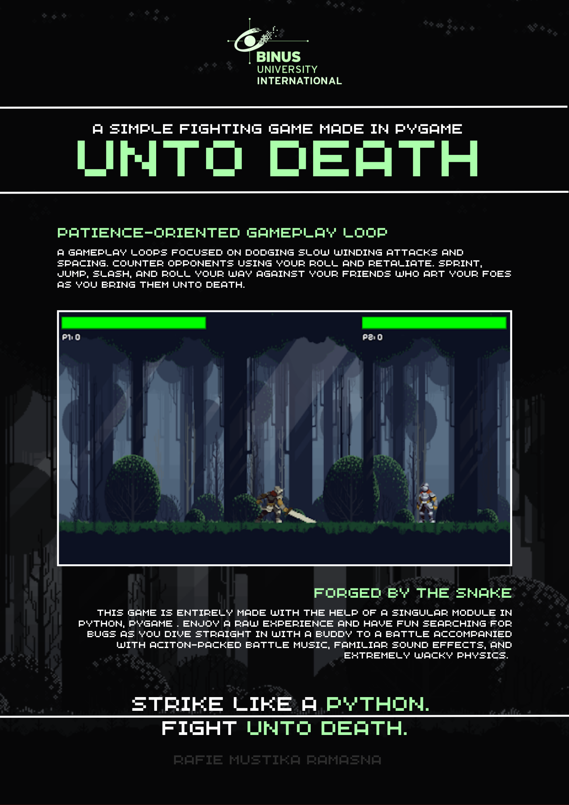

# Unto Death



This is a game created for Algorithm and Programming and serves as the final project. 

## Features
- Couch Multiplayer Fighting Game
- A patience-oriented gameplay loop focusing more on parrying and timing to mitigate spamming
- ~~LAN play through sockets~~ As of now this will not be done and is in the *to make* list.

## Installation
Running the game requires you to git clone this one any IDE or straight from github desktop through the link. 
After cloning the game insure you have the **pygame** module downloaded  if not follow the commands below.

Run the script through:
```
# Windows CLI
pip install pygame
cd PATH/TO/GITHUB/CLONE/Unto_Death
python main.py
```
or
```
# MAC / UNIX CLI
pip install pygame
cd PATH/TO/GITHUB/CLONE/Unto_Death
python3 main.py
```
or

Running it on an IDE like __Pycharm__ or __Visual Studio Code__. 

## How to Play
The controls are listed for both players below.

### Player 1
- Q -> Parry
- W -> Jump
- A AND D -> Move Left and Right
- R AND T -> Attack
- LSHIFT -> Sprint

### Player 2
- ' -> Parry
- UPARROW -> Jump
- LEFTARROW, RIGHTARROW -> Move Left and Right
- / AND . -> Attack
- RSHIFT -> Sprint


